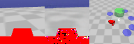

# Safe Stochastic Latent Actor-Critic in PyTorch
This is a PyTorch implementation of Safe Stochastic Latent Actor-Critic, proposed in:
- "Safe Reinforcement Learning From Pixels Using a Stochastic Latent Representation" by Yannick Hogewind, Thiago D. Simão, Tal Kachman, and Nils Jansen, ICLR 2023. https://openreview.net/forum?id=b39dQt_uffW

The implementation is based on Toshiki Watanake's PyTorch [implementation](https://github.com/toshikwa/slac.pytorch) of SLAC[1].

## Sample rollouts
Shown here are some videos of example rollouts after training Safe SLAC in the SafetyGym6 environments. The leftmost image shows the observation, the middle is the latent variable model reconstruction and the rightmost image shows an overview of the environment. The objective is for the red agent to avoid blue and purple hazards while reaching the green goal. The environments shown are PointGoal1, PointGoal2, DoggoGoal1, CarGoal1, PointButton1, PointPush1.





## Setup
The dependencies can be installed using `pip install -r requirements.txt`. Please see [mujoco-py](https://github.com/openai/mujoco-py/tree/v2.0.2.5) for instructions on setting up Mujoco. Mujoco 2.0 requires a license file, which can be obtained freely together with the binaries at [roboti.us](https://www.roboti.us/).

Since not all dependencies are available at PyPi for the most recent versions of Python, the easiest way to get started is to install the dependencies inside a conda virtual environment based on Python 3.8, i.e.

```
conda create -n "safe-slac" python==3.8
conda activate safe-slac
pip install -r requirements.txt
```

Depending on your machine, you may need to deviate from the specified PyTorch installation. In that case, please install PyTorch following [instructions](https://pytorch.org/get-started/locally/) here.

Should you encounter Numpy compatibility issues, a possible fix is to install Numpy 1.22.4 instead of the version required by SafetyGym: `pip install numpy==1.22.4`.

You can train Safe SLAC as shown in the following example. Hyperparameters are constant across the various tasks.

```
python train_safe.py --domain_name Safexp --task_name PointGoal1 --seed 0 --cuda
```
```
> python train_safe.py --help
usage: train_safe.py [-h] [--num_steps NUM_STEPS] [--domain_name DOMAIN_NAME] [--task_name TASK_NAME] [--seed SEED]
                     [--cuda]

optional arguments:
  -h, --help            show this help message and exit
  --num_steps NUM_STEPS
                        Number of training steps
  --domain_name DOMAIN_NAME
                        Name of the domain
  --task_name TASK_NAME
                        Name of the task
  --seed SEED           Random seed
  --cuda                Train using GPU with CUDA
```

## References
[[1]](https://arxiv.org/abs/1907.00953) Lee, Alex X., et al. "Stochastic latent actor-critic: Deep reinforcement learning with a latent variable model." arXiv preprint arXiv:1907.00953 (2019).
